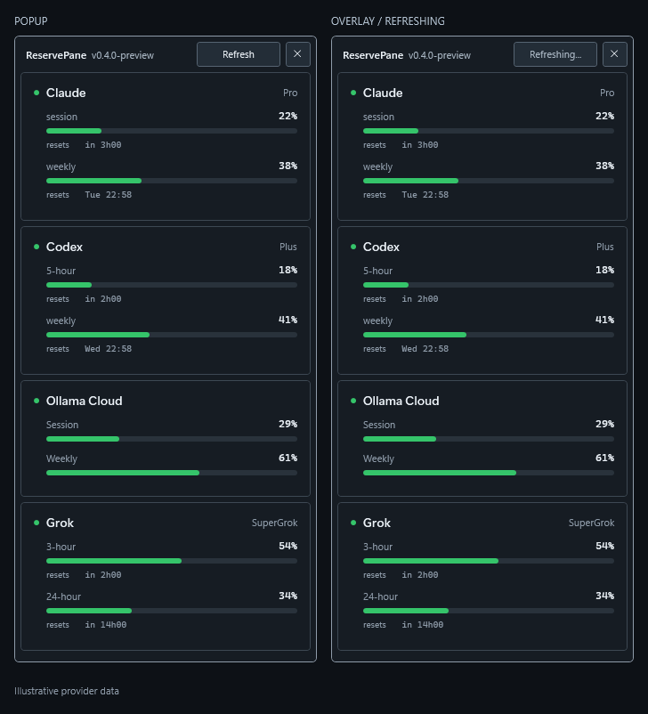

<p align="center">
  
</p>

<h1 align="center">ReservePane</h1>

ReservePane is a Windows tray application that shows Claude, Codex, Grok, OpenCode,
OpenCode Go, and Ollama Cloud status at a glance. It displays current usage windows in a tray
popup, can keep an optional overlay above other windows, and raises
notifications when usage crosses configured thresholds.



*Popup and overlay shown with mocked provider data.*

## Features

- Claude, Codex, Grok, OpenCode Company Seat, and OpenCode Go usage windows
- Ollama Cloud usage through the existing Ollama CLI sign-in
- Tray status based on the most urgent provider state
- Optional movable, always-on-top overlay
- Refresh and Close to tray controls in both status windows
- Configurable warning and critical thresholds
- Global `Ctrl+Alt+A` overlay shortcut
- Optional start with Windows

## Requirements

- Windows 10 version 2004 or newer on x64
- Claude Code, Codex CLI, Grok CLI, and/or OpenCode already authenticated for
  their respective cards
- Ollama CLI signed in with `ollama signin` for the Ollama Cloud card

ReservePane reads only the required credential fields from files created by
Claude Code, Codex CLI, Grok CLI, OpenCode, and Ollama CLI. It does not write those files,
refresh tokens, or log credentials, account identifiers, or API response bodies.
Providers are discovered from their local prerequisites. Providers that are not
configured or installed remain hidden.

Ollama Cloud uses the CLI's `%USERPROFILE%\.ollama\id_ed25519` identity to sign a
bodyless request to the cloud usage endpoint. A separate API key and a running
local model server are unnecessary. Run `ollama signin` again if the card asks
you to sign in. Legacy session and weekly quotas display the percentages reported
by Ollama. Monthly quota remains unavailable when the response does not establish
its unit or total allowance. Reset times are shown only when established by the
provider contract.

Refreshing shows progress, retries eligible providers immediately, and preserves
the last successful data with its age when a request fails. Provider-imposed
retry delays remain in effect; the card shows the next permitted retry time.
Close hides the window while ReservePane keeps running in the tray.

Polling uses only allowlisted usage and account metadata endpoints. The HTTP
transport rejects inference requests before sending them, so polling does not
consume model tokens. Credential checks use `claude auth status` and read-only
OpenCode database queries; ReservePane never starts a model prompt to test access.

## Installation

Download the versioned `.msi` from the GitHub Release and run it. The installer
contains the required .NET runtime, installs for the current user without
elevation under `%LOCALAPPDATA%\Programs\ReservePane`, and creates a Start Menu
shortcut. After a successful fresh full-UI installation, ReservePane starts
automatically. Silent or basic-UI installs, upgrades, and repairs do not start
it. The installer does not create a desktop shortcut or enable Start with
Windows. Windows may show an unknown-publisher warning because the package is
not signed.

ReservePane appears in Windows Apps & Features after installation. Uninstalling
removes the application and shortcut while preserving settings and logs under
`%APPDATA%\ReservePane`.

The release ZIP is the portable alternative. Its `ReservePane.exe` requires the
[.NET 10 Desktop Runtime](https://dotnet.microsoft.com/download/dotnet/10.0).
Verify either download with its adjacent SHA-256 checksum file.

For unattended install or removal, use Windows Installer from PowerShell:

```powershell
msiexec.exe /i .\ReservePane-vX.Y.Z-win-x64.msi /qn /norestart
msiexec.exe /x .\ReservePane-vX.Y.Z-win-x64.msi /qn /norestart
```

## Build

Install the [.NET 10 SDK](https://dotnet.microsoft.com/download/dotnet/10.0),
then run:

```powershell
dotnet restore ReservePane.slnx
dotnet build ReservePane.slnx -c Release --no-restore
dotnet test ReservePane.slnx -c Release --no-build
dotnet publish src/ReservePane/ReservePane.csproj -c Release -p:PublishProfile=win-x64
```

The publish profile produces a framework-dependent, single-file
`ReservePane.exe` for Windows x64.

## Releases

Versions, changelog entries, and Windows release artifacts are managed through
Release Please. See [docs/release-process.md](docs/release-process.md) for the
Conventional Commit rules, approval flow, repository settings, and recovery
procedure.

## Configuration

ReservePane creates `%APPDATA%\ReservePane\settings.json` on first launch. The
defaults poll once per minute while active, use 80 and 95 percent warning
thresholds, keep the overlay hidden, and leave autostart disabled.

When no `opencode-go` API key exists, ReservePane automatically discovers
OpenCode Console through the local `opencode` command. No provider setting is
required. If several workspaces expose Go quota, use their stable selector to
choose one:

```json
"opencode-go": {
  "OpenCodeConsole": {
    "WorkspaceSelector": "0123456789abcdef0123456789abcdef0123456789abcdef0123456789abcdef"
  }
}
```

ReservePane reads the OpenCode account database through the read-only
`opencode db` command and keeps access tokens in memory only. A configured
`opencode-go` API key always takes precedence. A single workspace with Go quota
is selected automatically. If several are eligible, the provider card lists the
stable selector values accepted by `WorkspaceSelector`.

OpenCode Company Seat monitoring is discovered automatically from the active
Console account and workspace. It uses OpenCode's private Console contract,
keeps identifiers and the access token in memory, and fails safely if the
unsupported contract changes. The displayed values are member budget data, not
organization-wide totals.

Runtime logs are written to `%APPDATA%\ReservePane\log.txt`. Logs contain status
categories only, not exception messages, headers, bodies, tokens, account IDs,
or email addresses.

## Security

Do not include credentials, account identifiers, or live API responses in bug
reports. See [SECURITY.md](SECURITY.md) for private vulnerability reporting.

## License

ReservePane is available under the [MIT License](LICENSE).
